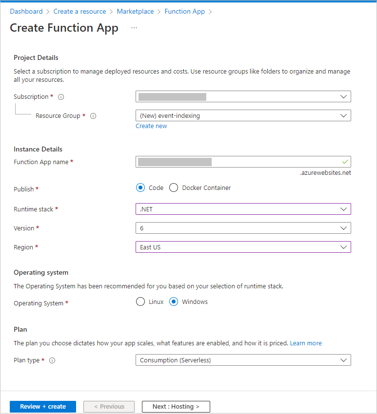
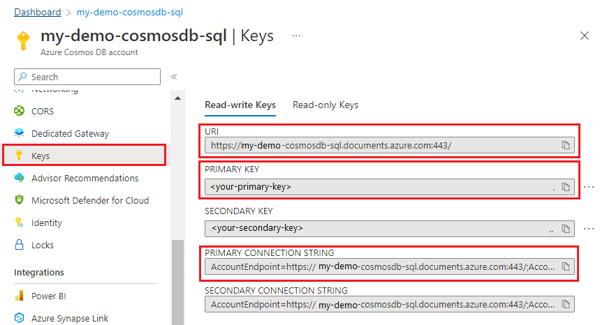
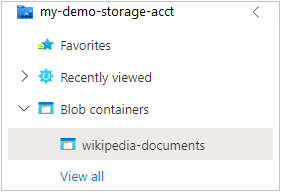
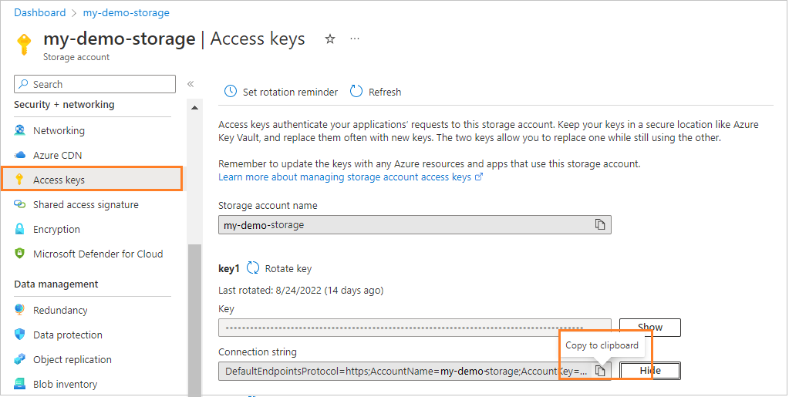
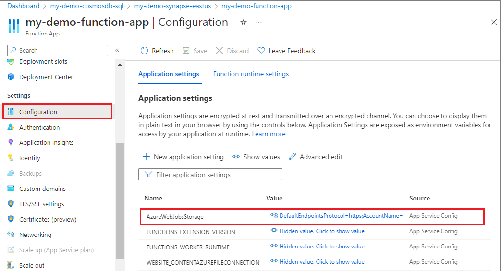
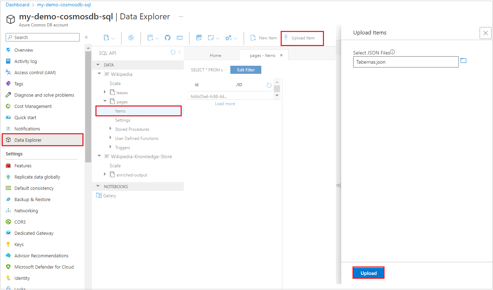
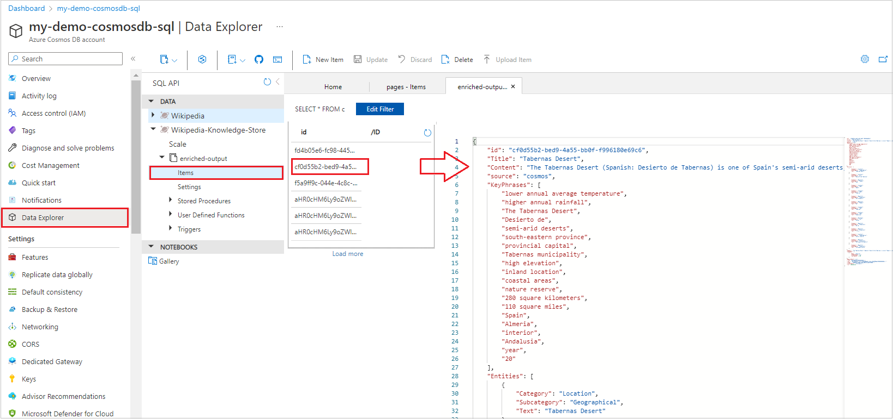
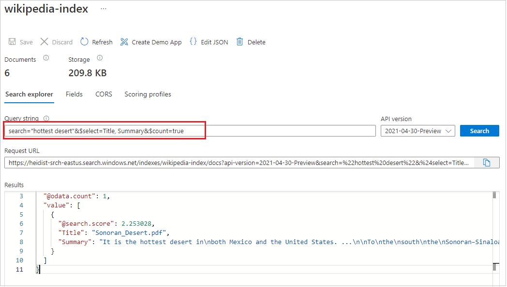

# Use an event-driven trigger for indexing in Azure Cognitive Search

This C# sample is an Azure Function app that demonstrates event-driven indexing in Azure Cognitive Search. If you've used indexers and skillsets before, you know that indexers can run on demand or on a schedule, but not in response to events. This demo shows you how to set up an indexing pipeline that responds to data update events. 

Instead of an indexer, the demo uses a function app that listens for data updates in Cosmos DB or Blob Storage. Instead of skillsets (which are indexer-driven), this demo makes direct calls to Cognitive Services. The enriched output is sent to a different Cosmos DB database. From there, the data is pushed into a queryable search index in Cognitive Search.

To trigger this workflow, you'll start the app and then upload files to either Cosmos DB or Blob Storage. Either one starts the workflow. When all processing is complete, you should be able to query a search index for content.

[Sample data](/sample-data/) consists of pages from Wikipedia about famous deserts (Sahara, Sonoran, and so forth). Files are provided in PDF and JSON format. JSON files should be uploaded to the "pages" container in Cosmos DB. PDFs should be uploaded to the "wikipedia-documents" container in Azure Storage.

## Prerequisites

+ [Visual Studio Code](https://code.visualstudio.com/download), with a [C# extension](https://marketplace.visualstudio.com/items?itemName=ms-dotnettools.csharp) and [.NET Core tools](https://marketplace.visualstudio.com/items?itemName=formulahendry.dotnet)
+ [Azure Cognitive Search](https://docs.microsoft.com/azure/search/search-create-service-portal), Basic or above
+ [Azure Cognitive Services](https://docs.microsoft.com//azure/cognitive-services/cognitive-services-apis-create-account), multi-service and multi-region
+ [Azure Cosmos DB (SQL API)](https://docs.microsoft.com/azure/cosmos-db/sql/how-to-create-account)
+ [Azure Storage](https://docs.microsoft.com/azure/storage/common/storage-account-create)
+ An [Azure Function app](https://docs.microsoft.com/azure/azure-functions/functions-create-function-app-portal#create-a-function-app), with a runtime stack of .NET 6 on a Windows operating system. The following screenshot illustrates the configuration.

   

## Set up storage and get connection information

Use Azure portal to create databases and containers for storing data in Cosmos DB and Azure Storage. While in the portal, get the keys and connection strings you'll need for establishing connections. You'll paste these values into the local.settings.json file in a later step.

1. In Cosmos DB, use **Data Explorer** to create a database named "Wikipedia" and a container named "pages". The "pages" container will eventually store Wikipedia pages as JSON documents.

1. Create a second database named "Wikipedia-Knowledge-Store" and a container named "enriched-output". This database receives all output generated by Cognitive Services, whether its from JSON file updates in the "pages" container, or PDF file updates in Azure Storage. This will be the data that gets pushed to a Cognitive Search index.

   

1. While in Cosmos DB, open the **Keys** page and get a full connection string for account. Also copy the individual values for the key and URI.

   

1. In Azure Storage, use **Storage browser** to create a container named "wikipedia-documents". This container will store Wikipedia pages as PDF files.

   

1. While in Azure Storage, open the **Access keys** page and get a full connection string for the account.

   

## Get started

1. Clone the sample repo or download a ZIP of its contents to get the demo code.

1. Start Visual Studio Code and open the folder containing the project.

1. Modify **local.settings.json** to provide the connection information needed to run the app. All of these values can be found in the Azure portal.

   + For "AzureWebJobsStorage", navigate to your function app. Get the "AzureWebJobsStorage" connection string from the **Configuration** page.

     

   + For "serverlessindexing_STORAGE", navigate to your Azure Storage account. Get the full connection string from the **Access keys** page. 

   + For "serverlessindexing_DOCUMENTDB", navigate to your Cosmos DB account. Get the full connection string from the **Keys** page. Make sure you remove the trailing semicolon (`;`) character from the connection string after pasting this string.

   + For "KS_Cosmos_Endpoint", "KS_Cosmos_Key", "KS_Cosmos_DB", and "KS_Cosmos_Container", get the individual values from **Data Explorer** and the **Keys** page.

   + For "Cog_Service_Key" and "Cog_Service_Endpoint", navigate to your Cognitive Services multi-region account. Get the key and endpoint from the **Keys and Endpoint** page.

   + For "Search_Service_Name" and "Search_Admin_Key", navigate to your search service. Get just the service name (not the full URL) from the **Overview** page. Get the admin API key from the **Keys** page. This demo creates a search index on your search service using the "Search_Index_Name" that you provide in settings.

1. Press F5 to run the sample locally.

1. Wait for the lease to be acquired. 

   

1. Trigger indexing and enrichment. For this step, return to Azure portal and upload either a JSON file to Cosmos DB ("pages" container in the "Wikipedia" database) or upload a PDF file to Azure Storage ("wikipedia-documents" in Blob Storage). The JSON files are smaller and will process more quickly.

   

1. The process is finished when you see a success notification in the terminal output: `"[2022-09-08T23:55:35.150Z] Executed 'CosmosIndexer' (Succeeded, Id=12bcf404-9bcc-4403-837b-fb5544dedefc, Duration=9392ms)"`

## Check progress

Besides the output that appears in the terminal session in Visual Studio Code, you can check your Azure resources:

1. In Cosmos DB, check "Wikipedia-Knowledge-Store/enriched-output" to verify that Cognitive Services output was generated.

   

1. In Azure Cognitive Search, open **Search Explorer** and find the "wikipedia-index". You can select **Search** to run an empty query that returns all content, or you paste in this query for brevity: `search="hottest desert"&$select=Title, Summary&$count=true`

   

## Objects created in this demo

As part of set up, you created multiple databases and containers. Other objects were created when the demo ran. All together, you should have the following assets in your Azure resources.

+ In Azure Functions, a function app with two functions added when the program ran:
  + BlobIndexer function that triggers enrichment and indexing when content is added to blob container ("pages")
  + CosmosIndexer function that triggers enrichment and indexing when content is added to blob container ("wikipedia-documents")

+ In Cosmos DB, a container for workflow state ("leases") is created by the demo code. The leases container stores state information while your app is running. You should also have a container for uploading the sample JSON files ("pages").

+ In Cosmos DB, a "Wikipedia-Knowledge-Store" database with an "enriched-output" container that you created. It collects enriched output generated by Cognitive Services when you add JSON files and PDFs to the pipeline. 

+ In Azure Storage, a "wikipedia-documents" container for uploading the sample PDF files.

+ In Azure Cognitive Search, a search index ("wikipedia-index") that's created and loaded by the demo code. It's based on the schema provided in DocumentModel class and the name provided in the JSON settings file. It's loaded with documents in "Wikipedia-Knowledge-Store".

<!-- ## Deploy to Azure

Optionally, if you'd like to switch from local to cloud-based processing, transfer the connection information from **local.settings.json** to **appsettings.json** and deploy the app.

1. Fill in **appsettings.json** with the connection information necessary to reach all Azure resources. The entries are similar to local.settings.json, but these entries will be read by your app once it's deployed on Azure.

1. In Visual Studio Code, right-click the function app and select **Deploy to Azure**.

This demo uses hard-code access keys and connection strings for the connection. If you deploy to Azure, we strongly recommend that you either encrypt the keys using Azure Key Vault, or use Azure Active Directory for authentication and authorized access. -->

## Explore the code

This demo is based on a [serverless event-based architecture with Azure Cosmos DB and Azure Functions](https://docs.microsoft.com/azure/cosmos-db/sql/change-feed-functions). The workflow of this demo is as follows:

+ A function app listens for events in an Azure data source. This demo provides two functions, one for watching a Cosmos DB database, and another for watching an Azure blob container.

+ When a data update is detected, the function app starts an indexing and enrichment process:

  + First, the app calls Cognitive Services to enrich the content. It uses the Computer Vision OCR API to "crack" the document and find text. It then calls [Azure Cognitive Service for Language](https://docs.microsoft.com/azure/cognitive-services/language-service/overview) for language detection, entity recognition, and sentiment analysis. The enriched output is stored in a new blob container in Azure Storage.

  + Second, the app makes an indexing call to Azure Cognitive Search, indexing the enriched content created in the previous step. The search index in Azure Cognitive Search is updated to include the new information. The demo uses the [**Azure.Search.Documents**](https://www.nuget.org/packages/Azure.Search.Documents/) library from the Azure SDK for .NET to create, load, and query the search index.

## Clean up

When you're working in your own subscription, at the end of a project, it's a good idea to remove the resources that you no longer need. Resources left running can cost you money. You can delete resources individually or delete the resource group to delete the entire set of resources.

You can find and manage resources in the portal, using the **All resources** or **Resource groups** link in the left-navigation pane.

## Next steps

Visit the [official documentation site](https://docs.microsoft.com/azure/search/) for more tutorials and information.